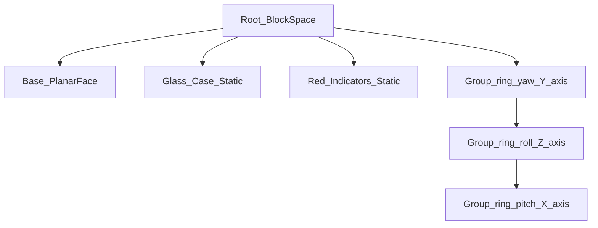
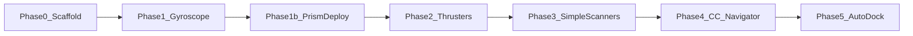

# Create AutoFlight — Revised Plan (Gyroscope First)

## Context

- Workspace: [`/home/headadmin/Documents/projects/mods/create autoflight`](/home/headadmin/Documents/projects/mods/create%20autoflight) — empty, greenfield.
- Platform: **NeoForge 1.21.1** (matches Create Aeronautics).
- **First deliverable:** Gyroscope block only, then deploy to Prism Launcher instance.
- Test instance: `/home/headadmin/.local/share/PrismLauncher/instances/robin automopdpac/.minecraft/`

---

## Phase 1 — Gyroscope Block (current focus)

### Visual design — Blockbench workflow

Use a **nested gimbal** (3 rings, **no center core**) modeled in Blockbench, animated in code via `BlockEntityRenderer` — **not** Bedrock animation files.



#### Blockbench setup

1. **Project type:** `File → New → Minecraft Java Block` (16×16×16 unit cube).
2. **Groups (critical):** 3 nested animated ring groups + static parts (user model):
   - `base_plate` — flat mounting face (default **bottom / -Y**). Sibling of rings, does not spin.
   - `glass_faces` — display case shell. Static sibling.
   - `red_north/east/south/west` — redstone contact strips. Static siblings.
   - `ring_yaw` — outer ring; pivot at `(8, 8, 8)`; **Y axis** (horizontal ring).
   - `ring_roll` — child of `ring_yaw`; **Z axis**.
   - `ring_pitch` — innermost child of `ring_roll`; **X axis**. **No core cube inside.**
3. **Ring geometry:** Each ring = many small box segments (user used `sub_ring_yaw/roll/pitch` parts at 22.5°/45° offsets to approximate a circle).
4. **Textures:** All borrowed — **no custom textures ship in the mod JAR** (see Texture mapping below).
5. **Export:**
   - Export **Java Block/Item model JSON** with groups preserved (`"groups"` array in modern Blockbench exports, or manual split).
   - **Do not** rely on JSON rotation animation — MC block models are static.
   - Save `.bbmodel` in repo at `assets/create_autoflight/models/block/gyroscope.bbmodel` for iteration.
6. **In-game animation (code):** `GyroscopeRenderer` reads per-axis angular velocity from block entity and applies:
   - `poseStack.translate(0.5, 0.5, 0.5)`
   - `mulPose` Y rotation → render `ring_yaw` children
   - `mulPose` X rotation → render `ring_pitch` children
   - `mulPose` Z rotation → render `ring_roll` children
   - `mulPose` X rotation → render `ring_pitch` children (innermost ring only — empty center)
   - Accumulate angles each partial tick: `angle += omega * partialTick` (wrap 0–2π).
   - **Visual spin rate** can be decoupled from physics torque (clamp display RPM for readability).

#### Alternative if group export is awkward

Export **4 separate sub-model JSON files** (`gyro_ring_yaw.json`, etc.) each with elements already positioned at rest. Renderer loads each with `BlockModel` / custom baked quads and applies transforms manually. Easier to debug than one monolithic JSON.

---

### Block behavior spec

| Property | Detail |
|---|---|
| **Planar face** | One side is a flat mounting plate; treated as **Down** by default |
| **Redstone inputs** | 4 horizontal sides (N/E/S/W relative to block rotation) — **not** top/bottom |
| **Modes (2)** | **Auto-Stabilize** (default): counter-rotates to hold level relative to configured Down face. **Manual**: redstone drives torque on mapped axes |
| **Torque cap** | Per-block max torque `τ_max` (Nm); summed gyros on ship add capacity; effectiveness ÷ ship mass |
| **Physics** | Torque applied at contraption **center of mass** (SE-style simplification) |

#### Redstone side mapping (Manual mode)

| Side | Input meaning |
|---|---|
| North | +pitch or -pitch (configurable invert) |
| East | +yaw or -yaw |
| South | -pitch or +pitch |
| West | -yaw or +yaw |

Signal strength 0–15 scales requested torque on that axis channel (0 = none, 15 = full channel share of `τ_max`).

#### Configuration UI (block screen)

Opened via wrench/right-click (Create-style ponder interaction or vanilla screen):

| Setting | Type | Default |
|---|---|---|
| **Down face** | 6-way face picker (which side is "down" for stabilization reference) | Planar face side |
| **Auto-stabilization** | Toggle on/off | On |
| **Force / torque** | Slider 0–100% of `τ_max` | 100% |
| **Stabilized axes** | 3 toggles: Pitch, Yaw, Roll | All on |

Sync all settings to block entity NBT; show on contraption diagram if feasible later.

#### Fair maximum torque (`τ_max`)

Proposed formula (tunable via config):

```
τ_max = BASE_TORQUE * (1 + adjacent_gyro_count * 0.1)
effective_torque = τ_max * force_percent * (gyro_count_on_ship / ship_mass_tons)
```

Suggested constants for MVP balance vs Aeronautics ships:

- `BASE_TORQUE = 50_000 Nm` per block at 100% (adjust after in-game testing against ~10–50 ton contraptions)
- Single gyro on small ship: noticeable but slow rotation
- 4–6 gyros on medium airship: responsive SE-like handling
- Cap **total applied torque per tick** to prevent infinite spin glitch

#### Auto-stabilize logic

1. Read contraption orientation vs world gravity vector (from `gimbal_sensor` math or direct quaternion).
2. Compute error angles for enabled axes relative to **configured Down face**.
3. PID (or P-only for MVP): `τ = clamp(Kp * error - Kd * angular_velocity, -τ_max, +τ_max)`.
4. Respect axis mask and force % slider.

---

### Texture mapping (user model — no custom PNGs)

User export: `Downloads/Gyro.bbmodel` + `Downloads/Gyro.json`. All textures are borrowed at runtime:

| Blockbench texture | Rewritten model path | Used on |
|---|---|---|
| `brass_casing` | `create:block/brass_casing` | `base_plate` |
| `contact_side` | `create:block/contact_side` | `red_north/east/south/west` (unlit) |
| `contact_side_powered` | `create:block/contact_side_powered` | lit overlay in BER when redstone > 0 |
| `BlockSprite_glass` | `minecraft:block/glass` | `glass_faces` |
| `294a4da4...` (iron) | `minecraft:block/iron_block` | all `sub_ring_*` elements |

**No textures in `assets/create_autoflight/textures/`** — only geometry JSON + optional `.bbmodel` source.

---

### Implementation files (expected)

```
create-autoflight/
  src/main/java/.../block/GyroscopeBlock.java
  src/main/java/.../block/entity/GyroscopeBlockEntity.java
  src/main/java/.../client/GyroscopeRenderer.java
  src/main/java/.../menu/GyroscopeMenu.java
  src/main/java/.../screen/GyroscopeScreen.java
  src/main/java/.../physics/GyroscopeForceContributor.java
  assets/create_autoflight/
    models/block/gyroscope.json     ← from Gyro.json (texture paths fixed)
    models/item/gyroscope.json
    blockstates/gyroscope.json
    models/source/gyroscope.bbmodel ← optional, from Downloads
```

Input assets from user: **`Gyro.bbmodel`** + **`Gyro.json`** only.

---

### Phase 1 completion — Prism Launcher deploy

After gyro builds successfully:

1. `./gradlew build` → `build/libs/create-autoflight-<version>.jar`
2. Copy JAR to: `/home/headadmin/.local/share/PrismLauncher/instances/robin automopdpac/.minecraft/mods/`
3. Kill running Prism instance if active, then launch `robin automopdpac` via Prism Launcher CLI (`prismlauncher -l "robin automopdpac"` or instance ID).

---

## Scanners — simplified (later phase)

**Names only imply purpose** — implementation is a normal block with simple queries, **no LiDAR sweep system**.

| Block name | Simple implementation |
|---|---|
| **Terrain Scanner** | Single or few `Level.clip()` raycasts forward (like stock Optical Sensor but exposed to CC/navigator); returns distance to terrain |
| **Contraption Scanner** | AABB overlap query for simulated entities in radius; returns distance, velocity, bounding box |

Hitbox data comes from contraption assembly bounds — no per-frame ray grid.

---

## Remaining block catalog (deferred)

### Tier 1 — Propulsion (after gyro)

- Atmospheric Thruster / Compact
- 5-Face Atmospheric Maneuvering Thruster
- Inertial Dampener Module
- Thruster Control Hub

### Tier 2 — Autopilot helpers (after scanners + thrusters)

- Flight Computer
- Docking Assist Computer
- Waypoint Beacon

### Tier 3 — CC / Avionics (after hardware exists)

- Peripherals via Create: Avionics SPI
- `autoflight` Lua library mirroring SE autopilot API
- Example scripts + docs

---

## Revised implementation order



---

## Success criteria — Phase 1 only

- Gyroscope places on contraption; 3 rings spin visually when applying torque.
- Auto-stabilize holds ship level relative to configured Down face.
- Manual mode responds to redstone on 4 sides.
- UI changes down face, auto-stabilize toggle, force %, and axis mask.
- Torque respects per-block cap and scales with ship mass.
- Mod loads in `robin automopdpac` Prism instance without crash.
