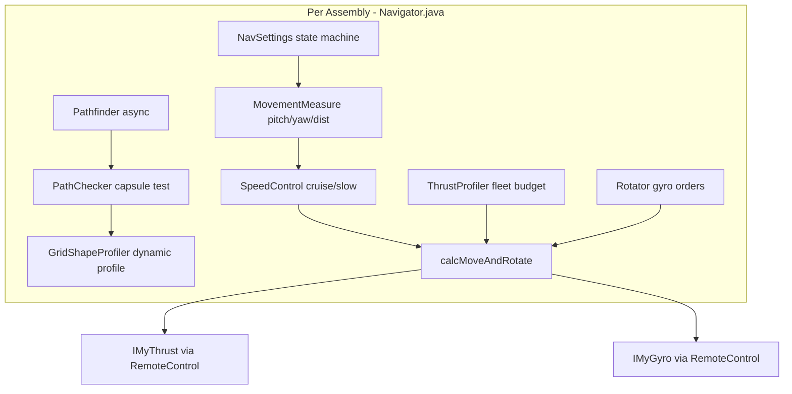
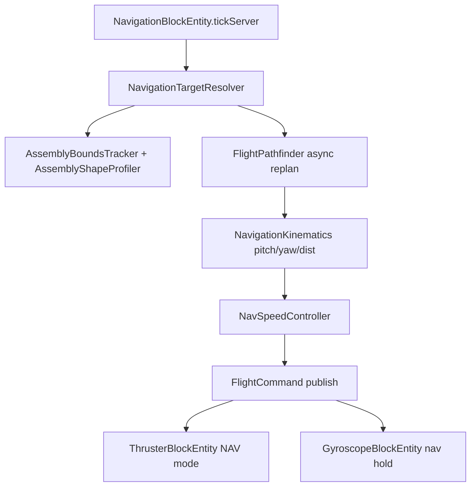

# Navigation Block — Implementation Plan

## Scope

**Flight machines only** for v1 — Sable-powered flying contraptions with thrusters + gyros. No ground rovers, missiles, landing sequences, or radar/engagement (all present in borrel but out of scope).

Primary reference: [borrel/Autopilot](https://github.com/borrel/Autopilot/tree/master/Autopilot/Scripts) (CC0 1.0 — free to port). This is the gold-standard SE autopilot used for navigation, collision avoidance, and docking.

---

## Critical research finding: borrel does NOT use voxel A*

Your original A* request is valid, but the SE Autopilot that actually works in production uses a **different, better-suited algorithm for flying grids**:

| What you asked for | What borrel actually does |
|---|---|
| Voxel/grid A* | **Capsule swept-path** from ship center → destination |
| Static inflated bbox | **Dynamic ship profile** rebuilt on block add/remove |
| Graph search | **Ray/obstruction test** + **perpendicular dodge waypoints** |
| Single planner | **Async pathfinder thread** (1 Hz replan, interrupt on target change) |

**Recommendation:** Port borrel's capsule pathfinder as Phase 2 primary. Optional voxel A* can be added later for macro route planning over very long distances, but capsule+dodge is what makes SE ships fly reliably through tight spaces.

---

## borrel Autopilot architecture (what we steal)



### File-by-file port map (SE → Minecraft)

| borrel source | Our Java port | Purpose |
|---|---|---|
| [`GridDimensions.cs`](https://github.com/borrel/Autopilot/blob/master/Autopilot/Scripts/GridDimensions.cs) | `AssemblyBoundsTracker` | Ship width/height/length in assembly frame; front-edge distance |
| [`GridShapeProfiler.cs`](https://github.com/borrel/Autopilot/blob/master/Autopilot/Scripts/Pathfinder/GridShapeProfiler.cs) | `AssemblyShapeProfiler` | **Dynamic hitbox for pathfinding** — tracks blocks, rebuilds on add/remove |
| [`PathCapsule.cs`](https://github.com/borrel/Autopilot/blob/master/Autopilot/Scripts/Pathfinder/PathCapsule.cs) | `FlightPathCapsule` | Swept capsule: line + radius, `Intersects(pos)` / `IntersectsAABB` |
| [`PathChecker.cs`](https://github.com/borrel/Autopilot/blob/master/Autopilot/Scripts/Pathfinder/PathChecker.cs) | `ObstaclePathChecker` | Broad-phase AABB collect → capsule vs obstacles |
| [`Pathfinder.cs`](https://github.com/borrel/Autopilot/blob/master/Autopilot/Scripts/Pathfinder/Pathfinder.cs) | `FlightPathfinder` | When blocked: perpendicular alternate waypoints at 8→16→32…m |
| [`MovementMeasure.cs`](https://github.com/borrel/Autopilot/blob/master/Autopilot/Scripts/MovementMeasure.cs) | `NavigationKinematics` | Pitch/yaw to waypoint, distToDest, movementSpeed |
| [`ThrustProfiler.cs`](https://github.com/borrel/Autopilot/blob/master/Autopilot/Scripts/ThrustProfiler.cs) | `ThrusterFleetProfiler` | Per-direction thrust budget; `scaleByForce()`; stopping distance |
| [`Rotator.cs`](https://github.com/borrel/Autopilot/blob/master/Autopilot/Scripts/Rotator.cs) | `GyroNavController` | Stop-and-rotate >15°; pitch/yaw decel profiles |
| [`SpeedControl.cs`](https://github.com/borrel/Autopilot/blob/master/Autopilot/Scripts/SpeedControl.cs) | `NavSpeedController` | Cruise/slow based on dist + stopping distance + closest obstacle |
| [`Navigator.cs`](https://github.com/borrel/Autopilot/blob/master/Autopilot/Scripts/Navigator.cs) | `AssemblyFlightController` | State machine orchestrating all of the above |
| [`NavSettings.cs`](https://github.com/borrel/Autopilot/blob/master/Autopilot/Scripts/NavSettings.cs) | `NavigationSettings` | moveState, rotateState, destinationRadius, waypoints |

---

## Dynamic hitbox — two layers (borrel + your setting)

borrel solves dynamic ship size with **two complementary mechanisms**. We port both and add your approach-mode shrink.

### Layer 1: Pathfinding capsule (GridShapeProfiler)

When flying toward a destination, borrel does NOT use the raw WorldAABB. Instead:

1. **Track every block** on the assembly (`OnBlockAdded` / `OnBlockRemoved` → refresh `SlimBlocks` list).
2. **Vector-reject** each occupied cell from the flight-direction axis → `rejectionCells` (cross-section silhouette).
3. **Capsule radius** = max rejection distance from center + 3× grid size margin.
4. **Capsule endpoints** = ship center → destination, extended past dest by nav-block-to-front distance.

```java
// Port of GridShapeProfiler.createCapsule()
float capsuleRadius = sqrt(maxRejectionDistSq) + margin;
Vector3d P0 = assemblyCenterWorld;
Vector3d P1 = destinationWorld + extensionPastDest;
FlightPathCapsule path = new FlightPathCapsule(P0, P1, capsuleRadius);
```

5. **Obstruction test:** for each foreign block cell, test `path.Intersects(cellWorld)` AND `shapeProfiler.rejectionIntersects(cell)` — the rejection filter prevents the ship's own width from causing false positives when passing through gaps it could fit.

**This is the dynamic pathfinding hitbox.** It automatically grows/shrinks when you add/remove blocks mid-flight.

### Layer 2: Physics collider shrink (your "avoidance off" setting)

Setting: **Turn off object avoidance X blocks from target** (UI slider 0–64).

When `distToGoal <= avoidanceOffDistance`:

| System | Normal flight | Approach mode |
|---|---|---|
| Pathfinder | Full capsule radius, alternate-waypoint search active | **Minimal capsule** (1-block radius); skip alternate search; fly direct |
| Sable physics | Full block colliders | `BlockSubLevelDynamicCollider`: `clearBoxes()` + single 1×1×1 at nav block / CoM |
| Speed | Cruise speed | `SpeedControl` slowdown (borrel: `destinationRadius` + stopping distance) |

borrel equivalent: when `DestGrid != null`, pathfinder switches to **slowdown mode** (exempt destination grid from obstruction). We generalize this to "approach any coordinate" with configurable distance.

**Implementation:** marker interface `AutoflightAssemblyBlock` on navigation + thruster + gyro blocks; each implements `BlockSubLevelDynamicCollider` and checks `FlightCommand.collisionShrinkActive`. Call `LevelPlot.updateBoundingBox()` after toggle.

Non-autoflight blocks on the contraption keep full collision — document this limitation.

---

## Capsule pathfinder algorithm (replaces A*)

Ported from [`Pathfinder.CheckPath()`](https://github.com/borrel/Autopilot/blob/master/Autopilot/Scripts/Pathfinder/Pathfinder.cs):

```
1. Test straight line navBlock → destination
   → Path_Clear: proceed

2. If obstructed at pointOfObstruction:
   a. Generate 4 perpendicular vectors from flight line
   b. For distance = 8, 16, 32, 64, 128, 256, 512, 1024, 2048, 4096, 8192:
      - For each perpendicular direction (sorted by closeness to dest):
        - alternatePoint = obstruction + distance × perpVector
        - If TestPath(alternatePoint) clear AND path is "useful" (gets closer to dest):
          → Alternate_Path: set waypoint, proceed
   c. Try forward/backward sidestep (128→2 blocks binary search)
   d. No_Way_Forward: fullStop
```

**Obstacle sources** (adapt `PathChecker.collect_Entities`):
- Other Sable assemblies (`getAllIntersecting` broad phase, then per-block capsule test)
- Solid world blocks (sample along capsule at coarse intervals)
- Skip: attached grids, self, tiny debris (<1000 mass equivalent)

**Replan:** async every 1 s (borrel `nextRun`); interrupt immediately on target/waypoint change.

---

## Flight controller state machine (Navigator port)

borrel separates **move**, **rotate**, and **pathfinder permission**:

### Move states (`NavSettings.Moving`)
- `NOT_MOVE` → waiting for rotation or pathfinder
- `HYBRID` → rotate while moving (default for flight machines)
- `MOVING` → full forward flight
- `SIDELING` → strafe toward alternate waypoint
- `STOP_MOVE` → braking

### Rotate states (`NavSettings.Rotating`)
- If `rotLenSq > 0.685` (~15°): **fullStop**, rotate first (maps to gyros)
- `ROTATING` → apply pitch/yaw torque with decel profile
- `STOP_ROTA` → wait for angular velocity zero

### Pathfinder gate
- `PathfinderAllowsMovement = false` during `Searching_Alt` or `No_Way_Forward`
- `collisionCheckMoveAndRotate()` runs **before** `calcMoveAndRotate()` every tick

### Speed control (borrel `SpeedControl`)
- `stoppingDistance = speed² / maxAcceleration` (from thruster fleet profile)
- If `distToDest < 2 × stoppingDistance` → reduce cruise/slow speeds
- If `closestObstacle < slowSpeed` → cap speed to `closestDist + 10`
- Between cruise and slow: coast (zero thrust command, dampeners handle drift)

**Minecraft mapping:** our inertial thrusters replace SE dampeners/thrusters; gyros replace `IMyGyro`.

---

## Operating modes (our block)

| Mode | Trigger | borrel equivalent |
|---|---|---|
| **NavTable** | Block under `simulated:navigation_table` (offset = `tablePos.relative(facing.getOpposite())`) | `coordDestination` from nav item via `NavigationTarget.ofStack(item).getTarget(navBE, item)` |
| **Hold** | Standalone; Activate in UI | Station-keep: target = snapshot pose; zero velocity desired |
| **Idle** | Deactivated / no target | `fullStop`; release flight commands |

Nav table: no link event — read `NavTableBlockEntity` directly ([`getHeldItem()`](https://github.com/borrel/Autopilot/blob/master/Autopilot/Scripts), `getTargetPosition()`, `distanceToTarget()`).

---

## Architecture (Minecraft)



- **One controller per root assembly** (lowest nav block wins if multiple).
- Controller runs on **game tick** (20 TPS); thrusters/gyros apply on **physics tick** (lesson from thruster flicker fix).
- Root assembly: `resolveRootAssembly()` via `getSplitFromSubLevel()` chain (existing thruster code).

### FlightCommand fields
```java
record FlightCommand(
    Vector3d desiredWorldVelocity,
    Quaterniond desiredOrientation,
    boolean navActive,
    boolean collisionShrinkActive,  // approach mode
    float capsuleRadiusOverride,      // -1 = full profile, 0.5 = 1-block
    Vector3d activeWaypoint           // null = fly to final dest
) {}
```

### Thruster changes ([`ThrusterBlockEntity`](src/main/java/dev/createautoflight/content/thruster/ThrusterBlockEntity.java))
- `ThrusterMode { BRAKE, NAVIGATION }` — user chose extend thrusters
- NAV mode: thrust along `normalize(desiredVel - currentVel)` with fleet budget from `ThrusterFleetProfiler`
- Port `scaleByForce()`: scale displacement to weakest-axis thruster capacity
- Port `getStoppingDistance()` for approach slowdown
- Separate `navEngaged` latch (game-tick updated, not per physics substep)

### Gyro changes ([`GyroscopeBlockEntity`](src/main/java/dev/createautoflight/content/gyroscope/GyroscopeBlockEntity.java))
- Port `Rotator`: when nav provides `desiredOrientation`, override AUTO/MANUAL
- Stop-and-rotate gate: if attitude error > 15°, zero translation command until aligned
- Keep existing damping during nav

---

## UI ([`NavigationScreen`](src/main/java/dev/createautoflight/client/) — new)

| Control | borrel equivalent |
|---|---|
| Activate / Deactivate | start/stop station-keep |
| Status | Path_OK / Pathfinding / No_Path / Holding |
| **Debug overlay** | **On/Off — in-world visualization (client-only render, synced snapshot)** |
| Avoidance off distance | approach shrink threshold (your setting) |
| Arrival radius | `destinationRadius` (default ~100 blocks, tunable) |
| Cruise speed % | `speedCruise_external` |
| Max speed slow % | `speedSlow_external` |
| Ignore terrain | `ignoreAsteroids` equivalent (skip world block checks) |

Packet: `ConfigureNavigationPacket` → [`ModPackets`](src/main/java/dev/createautoflight/network/ModPackets.java). Debug toggle stored on `NavigationBlockEntity` and synced to client.

---

## Debug overlay (in-game visualization)

**UI:** `Debug: On / Off` toggle in [`NavigationScreen`](src/main/java/dev/createautoflight/client/NavigationScreen.java) (same pattern as thruster Brake On/Off). Persisted in BE NBT; only the owning player’s client renders it (no spam for other players unless we later add a global debug key).

**Data sync:** Server publishes a compact `NavigationDebugSnapshot` each tick while nav is active (or when debug is enabled):

```java
record NavigationDebugSnapshot(
    Vec3 destinationWorld,
    Vec3 activeWaypointWorld,      // null if flying direct
    List<Vec3> pathWaypoints,      // ordered: current → … → dest
    Vec3 capsuleP0, Vec3 capsuleP1, float capsuleRadius,
    Vec3 assemblyCenterWorld,
    Vec3 desiredVelocityWorld,
    String mode,                   // Idle / NavTable / Hold / Approaching
    String pathfinderState,          // Path_Clear / Searching_Alt / Alternate_Path / No_Way_Forward
    double distToDest,
    double closestObstacleDist,
    boolean collisionShrinkActive,
    BoundingBox3d assemblyBoundsWorld  // optional wireframe
) {}
```

Synced via existing BE update packet (`getUpdateTag` / `ClientboundBlockEntityDataPacket`) when `debugOverlayEnabled` is true — avoids a separate packet type.

**Client renderer:** [`NavigationDebugRenderer`](src/main/java/dev/createautoflight/client/NavigationDebugRenderer.java)

Register on NeoForge `RenderLevelStageEvent` (after translucents) or Create’s level render hook if available. Follow patterns from [`GyroscopeRenderer`](src/main/java/dev/createautoflight/client/GyroscopeRenderer.java) for pose/transform math (assembly `logicalPose` is already synced indirectly via snapshot world coords computed server-side).

| Visual element | How it looks | Color (suggested) |
|---|---|---|
| **Destination** | Vertical beacon beam + small wireframe cube at target | Green |
| **Active waypoint** | Smaller marker + pulsing ring when != destination | Yellow |
| **Current path** | Line strip connecting nav block → waypoints → destination (1-block above ground clearance for visibility) | Cyan |
| **Flight capsule** | Wireframe swept capsule (line + end circles) when pathfinder ran | Orange, semi-transparent |
| **Assembly bounds** | Wireframe AABB of live ship profile | White |
| **Desired velocity** | Arrow from assembly CoM, length ∝ speed | Magenta |
| **Approach zone** | Wireframe sphere radius = `avoidanceOffDistance` around destination | Red when shrink active |

**HUD text** (top-left or above nav block via `GuiGraphics` in overlay pass):

- Mode, pathfinder state, dist to dest, speed, capsule radius, approach/shrink flag, waypoint count

**Phasing:**

- **Phase 1:** destination marker + straight-line path + basic HUD (mode, dist, desired vel arrow)
- **Phase 2:** full waypoint polyline, capsule wireframe, pathfinder state colors
- **Phase 3:** approach-radius sphere, assembly bounds wireframe, closest-obstacle distance

Debug rendering is **client-only** and has zero gameplay effect — safe to leave in production builds for tuning.

---

## Files to add / modify

**New (navigation package):**
- `NavigationBlock.java`, `NavigationBlockEntity.java`
- `AssemblyFlightController.java` (Navigator port)
- `NavigationSettings.java`, `FlightCommand.java`
- `NavigationTargetResolver.java`
- `AssemblyBoundsTracker.java` (GridDimensions port)
- `AssemblyShapeProfiler.java` (GridShapeProfiler port)
- `path/FlightPathCapsule.java`, `path/ObstaclePathChecker.java`, `path/FlightPathfinder.java`
- `NavigationKinematics.java`, `NavSpeedController.java`
- `ThrusterFleetProfiler.java`, `GyroNavController.java`
- `ConfigureNavigationPacket.java`, `NavigationScreen.java`, `ClientNavigationHandler.java`
- `NavigationDebugSnapshot.java` (server → client sync payload)
- `NavigationDebugRenderer.java` + register in [`ClientModEvents`](src/main/java/dev/createautoflight/client/ClientModEvents.java)
- `physics_block_properties/navigation.json`, assets

**Modify:**
- [`ModBlocks.java`](src/main/java/dev/createautoflight/registry/ModBlocks.java), [`ModBlockEntities.java`](src/main/java/dev/createautoflight/registry/ModBlockEntities.java), [`ModCreativeTabs.java`](src/main/java/dev/createautoflight/registry/ModCreativeTabs.java)
- [`ThrusterBlockEntity.java`](src/main/java/dev/createautoflight/content/thruster/ThrusterBlockEntity.java)
- [`GyroscopeBlockEntity.java`](src/main/java/dev/createautoflight/content/gyroscope/GyroscopeBlockEntity.java)

---

## Implementation phases

### Phase 1 — Foundation (straight-line flight, no obstacle avoidance)
- Navigation block + registry + UI + packet (including **Debug overlay** toggle)
- Nav table detection + target resolution
- `AssemblyFlightController` + `FlightCommand` + hold-position snapshot
- `AssemblyBoundsTracker` (static dimensions)
- Thruster NAV mode + gyro attitude hold
- Straight-line goto (no pathfinder yet)
- **Debug v1:** destination marker, straight-line path, HUD stats (`NavigationDebugRenderer`)

### Phase 2 — Capsule pathfinder (borrel port)
- `AssemblyShapeProfiler` with block add/remove tracking
- `FlightPathCapsule` + `ObstaclePathChecker`
- `FlightPathfinder` with perpendicular dodge + async replan
- `NavigationKinematics` + waypoint following
- `PathfinderAllowsMovement` gate
- **Debug v2:** waypoint polyline, capsule wireframe, pathfinder state coloring

### Phase 3 — Approach mode + speed polish
- 1-block physics collider shrink when within avoidance-off distance
- Minimal capsule radius in approach mode (disable dodge search)
- `NavSpeedController` + `ThrusterFleetProfiler.getStoppingDistance()`
- `NavSpeedController.adjustSpeedsByClosest()` for obstacle proximity
- Arrival detection, edge cases (target removed, assembly split, dimension)
- **Debug v3:** approach-radius sphere, assembly bounds wireframe, closest-obstacle readout

---

## What borrel teaches us NOT to do

- Do not run engagement latch / pathfinder updates per physics substep
- Do not use point-to-point raycast without ship cross-section (false collisions in gaps)
- Do not move while `PathfinderAllowsMovement == false`
- Do not skip stop-and-rotate for large heading errors (causes sideways drift)
- Do not use position impulses — use velocity PID + thrust scaling (`scaleByForce`)

---

## Open decision (still deferred)

**Optional voxel A*** for very long-range macro routes (>512 blocks) — can layer on top of capsule waypoints later. Capsule+dodge handles local flight; A* would only pre-compute coarse macro waypoints if needed.

Pathfinding variant from earlier discussion is superseded by borrel capsule approach unless you explicitly want both.

---

## License note

borrel/Autopilot is [CC0 1.0](https://github.com/borrel/Autopilot/blob/master/LICENSE) — algorithms and structure can be ported freely. Do not copy SE API types (`IMyCubeGrid`, `RemoteControl`); reimplement against Sable/NeoForge APIs.
