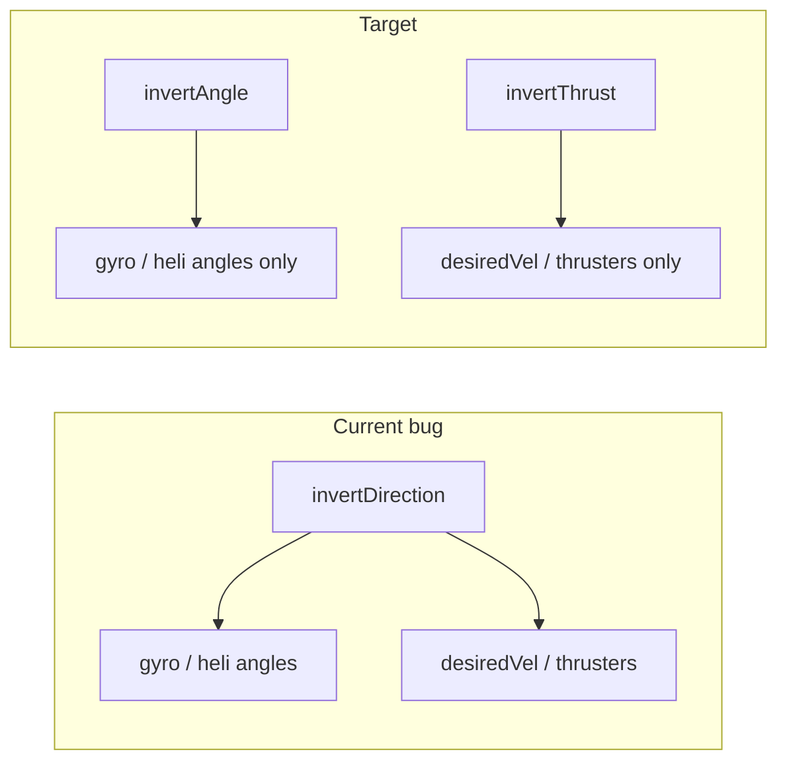
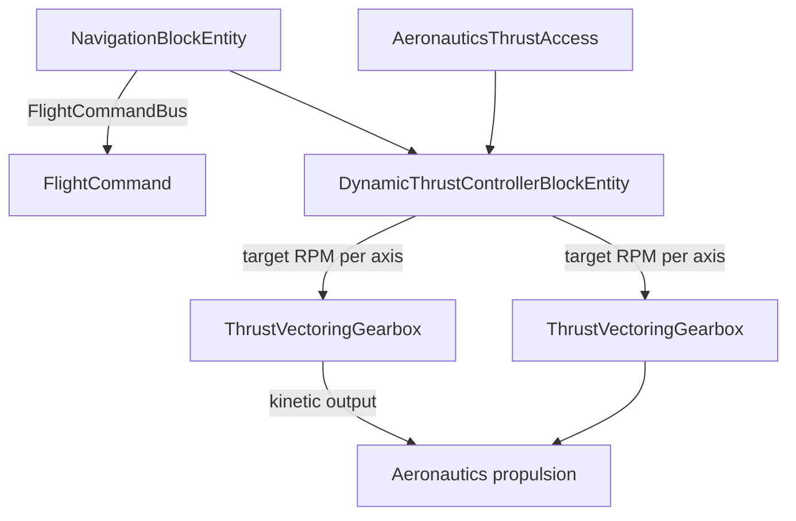

# Thrust Vectoring + Nav Invert Bug Fix

## Status

- **Nav table + gyro**: considered complete; no further gyro/nav feature work except the invert split below.
- **Known bug**: [`NavigationSettings.invertDirection`](src/main/java/dev/createautoflight/content/navigation/NavigationSettings.java) is applied to **both** orientation and movement in [`AssemblyFlightController`](src/main/java/dev/createautoflight/content/navigation/AssemblyFlightController.java) (lines 156–160, 380–418). Setting **Angle → Away** also reverses `desiredVel`, so Sable thrusters fly away. A separate **Thrust → Toward/Away** row is missing.

---

## Phase 1 — Split angle vs thrust (bug fix)

**Goal:** Independent nav-table controls; per-thruster **Forward/Reverse** unchanged ([`ThrusterBlockEntity.invertDirection`](src/main/java/dev/createautoflight/content/thruster/ThrusterBlockEntity.java)).

| Setting | UI label | Affects |
|---------|----------|---------|
| `invertAngle` | Angle: Toward / Away | `helicopterTargetAngles`, `desiredHelicopterOrientation`, `desiredOrientationToward` |
| `invertThrust` | Thrust: Toward / Away | `toTarget` / `moveDir` / `desiredVel` only |

**Files to change**

- [`NavigationSettings.java`](src/main/java/dev/createautoflight/content/navigation/NavigationSettings.java) — replace `invertDirection` with `invertAngle` + `invertThrust`; update `apply()`.
- [`AssemblyFlightController.java`](src/main/java/dev/createautoflight/content/navigation/AssemblyFlightController.java) — thrust paths use `isInvertThrust()`; orientation/gyro paths use `isInvertAngle()`.
- [`NavigationScreen.java`](src/main/java/dev/createautoflight/client/NavigationScreen.java) — add **Thrust** row; keep **Angle** row; `ROW_COUNT` 12 → 13.
- [`ConfigureNavigationPacket.java`](src/main/java/dev/createautoflight/network/ConfigureNavigationPacket.java) — pack second flag (e.g. bit `64` for `invertThrust`; keep bit `32` for `invertAngle`).
- [`NavigationBlockEntity.java`](src/main/java/dev/createautoflight/content/navigation/NavigationBlockEntity.java) — persistence + `applyConfiguration`.

**NBT migration:** read legacy `InvertDirection` as `invertAngle` only; `invertThrust` defaults `false` so existing worlds keep current thrust behavior until user changes it.

**No FlightCommand change needed** — thrusters already follow `desiredWorldVelocity`; splitting at the controller source is enough.

---

## Phase 2 — Aeronautics thrust vector adapter

**Dependency:** add Create Aeronautics jar to [`libs/`](libs/) and `compileOnly` in [`build.gradle`](build.gradle) (mod is already optional in [`neoforge.mods.toml`](src/main/resources/META-INF/neoforge.mods.toml)).

**New package:** `dev.createautoflight.integration.aeronautics`

- `AeronauticsThrustAccess` — resolve contraption handle from `ServerSubLevel` root (same entry point as [`AssemblyResolver`](src/main/java/dev/createautoflight/content/navigation/AssemblyResolver.java)).
- Returns per-axis or world thrust vector + optional hover baseline (thrust needed to counteract gravity at current mass/altitude).
- Guard with `ModList.get().isLoaded("aeronautics")`; controller blocks no-op or show UI warning if absent.

*Implementation note:* inspect Aeronautics API in the jar at build time and wire the exact handle method the user referenced (thrust vector of current contraption). Wrap behind interface so tests/mocks don’t need the full mod.

---

## Phase 3 — `thrust_vectoring_gearbox` block

**Role:** kinetic pass-through (input shaft → output shaft). Signed output RPM maps to thrust along a configured **local axis**.

**Block entity** (`ThrustVectoringGearboxBlockEntity`):

- Implements Create kinetic APIs (`IRotate` / `KineticBlockEntity` pattern used by Create gearboxes).
- Settings (UI + packet, mirror gyro/nav pattern):
  - **Axis:** Up / Down / North / South / East / West (block-local).
  - **Sign convention:** e.g. axis **Up** → negative output RPM produces negative thrust along that axis (per user spec).
- Exposes `getConfiguredAxis()` and `getSignedThrustScale(rpm)` for the controller.
- Registered on assembly via existing [`AutoflightAssemblyBlock`](src/main/java/dev/createautoflight/content/navigation/AutoflightAssemblyBlock.java) + [`AssemblyResolver`](src/main/java/dev/createautoflight/content/navigation/AssemblyResolver.java) actor scan (same as gyro/thruster).

**Registry:** [`ModBlocks`](src/main/java/dev/createautoflight/registry/ModBlocks.java), [`ModBlockEntities`](src/main/java/dev/createautoflight/registry/ModBlockEntities.java), blockstate/model (brass-casing style placeholder), creative tab, lang keys.

---

## Phase 4 — `dynamic_thrust_controller` block

**Role:** assembly-wide supervisor (user chose **all gearboxes on same Sable assembly**, no shaft path required).

**Modes (UI):**

| Mode | Behavior |
|------|----------|
| **Hover** (default) | PID per axis: drive measured thrust → hover thrust for current altitude/mass; recompute as altitude changes. |
| **Nav** | Follow [`FlightCommand.desiredWorldVelocity()`](src/main/java/dev/createautoflight/content/navigation/FlightCommand.java) projected onto each gearbox axis; uses nav `invertThrust` via existing command (after Phase 1). |

**Control loop (server tick, primary controller per assembly):**

1. Enumerate gearboxes on root assembly (`root.getPlot().getBlockEntityActors()`).
2. Read current thrust vector from Aeronautics.
3. Compute per-axis **demand**:
   - Hover: `demand = hoverThrust(axis) - measured(axis)` (+ gravity feedforward from assembly mass if API exposes it).
   - Nav: `demand = project(desiredVel) * gain` per axis, clamped by nav max thrust settings if linked to nav table.
4. Map demand → target output RPM per gearbox (respect max RPM, slew rate, sign convention).
5. Apply via Create kinetic stress/speed API on each gearbox output.

**Nav integration:**

- Subscribe to [`FlightCommandBus`](src/main/java/dev/createautoflight/content/navigation/FlightCommandBus.java) when mode = Nav and nav is active on same assembly.
- Optional: read [`NavigationSettings`](src/main/java/dev/createautoflight/content/navigation/NavigationSettings.java) from primary nav block (same `isPrimaryController` pattern as [`NavigationBlockEntity`](src/main/java/dev/createautoflight/content/navigation/NavigationBlockEntity.java)).
- Extend `FlightCommand` only if needed (e.g. `Vector3d desiredThrustWorld` for precision vectoring); otherwise project existing `desiredWorldVelocity` for v1.

**Primary controller:** if multiple controllers on one assembly, use lowest block pos or first-placed (document in UI); others idle.

---

## Phase 5 — UI, networking, persistence

Mirror existing patterns:

- [`GyroscopeScreen`](src/main/java/dev/createautoflight/client/GyroscopeScreen.java) / [`ConfigureGyroscopePacket`](src/main/java/dev/createautoflight/network/ConfigureGyroscopePacket.java)
- Client handlers in [`ClientModEvents`](src/main/java/dev/createautoflight/client/ClientModEvents.java)
- NBT + update packets on block entities

**Controller UI rows:** Mode (Hover/Nav), gain/slew limits, status readout (measured thrust, hover target, per-axis RPM).

**Gearbox UI rows:** Axis direction only.

---

## Phase 6 — Debug + test plan

- Reuse nav debug overlay optional line: thrust demand vs measured per axis.
- **Phase 1 test:** Angle=Away + Thrust=Toward → nose points away, ship still moves toward destination.
- **Hover test:** contraption holds altitude as y increases/decreases.
- **Nav test:** with Aeronautics propulsion + controller in Nav mode, ship tracks nav destination using gearbox thrust only (Sable thrusters optional).

---

## Suggested implementation order

1. Phase 1 (invert split) — small, unblocks user immediately.
2. Phase 2 (Aeronautics adapter) — unblock thrust feedback.
3. Phase 3 (gearbox block) — kinetic plumbing + axis config.
4. Phase 4–5 (controller + UI) — closed-loop hover, then nav mode.
5. Phase 6 (debug/polish).
